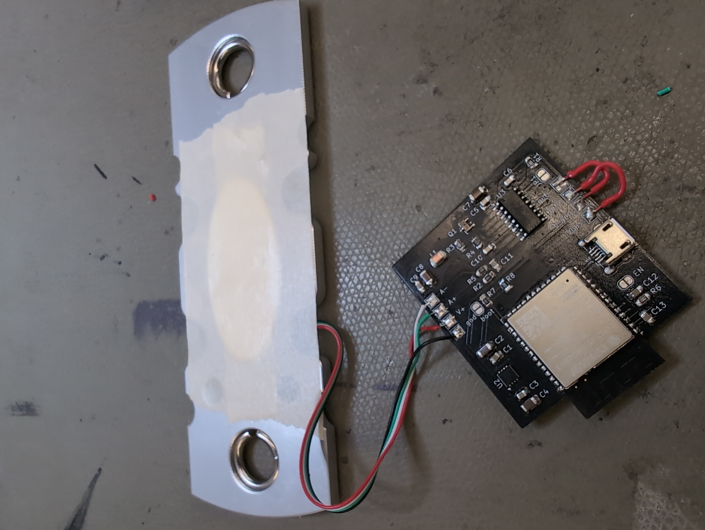
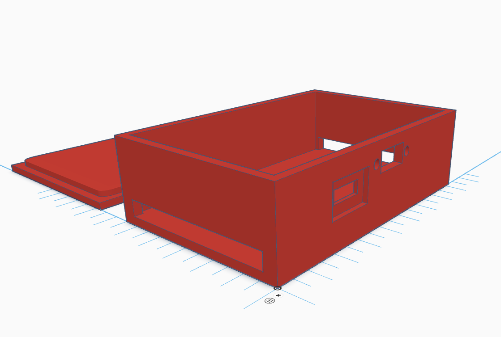
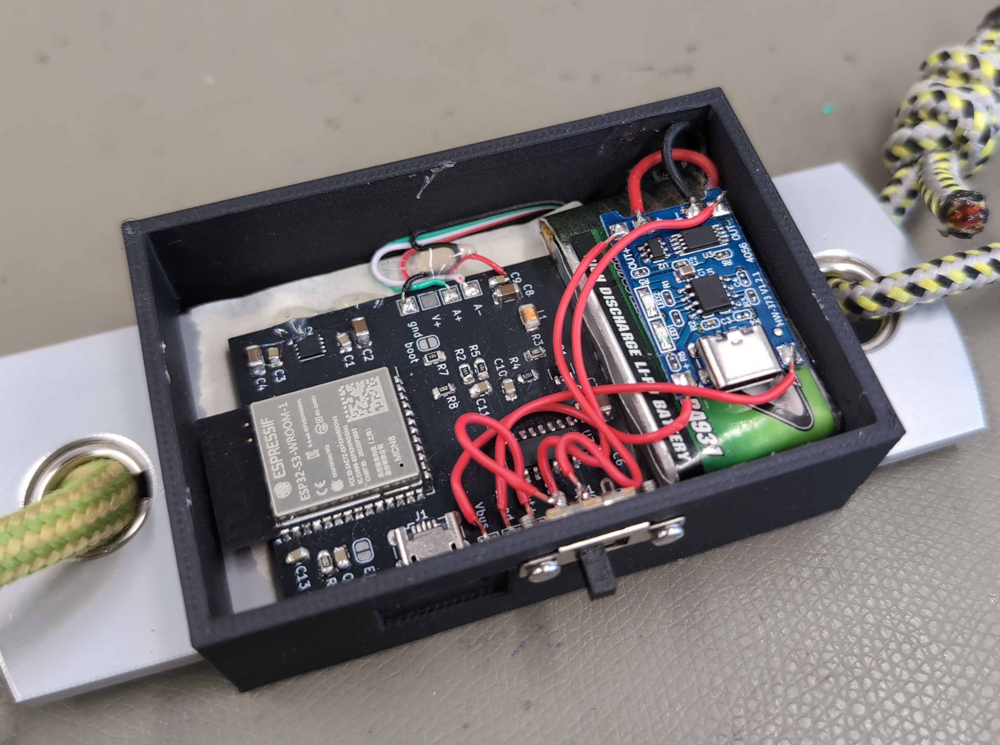
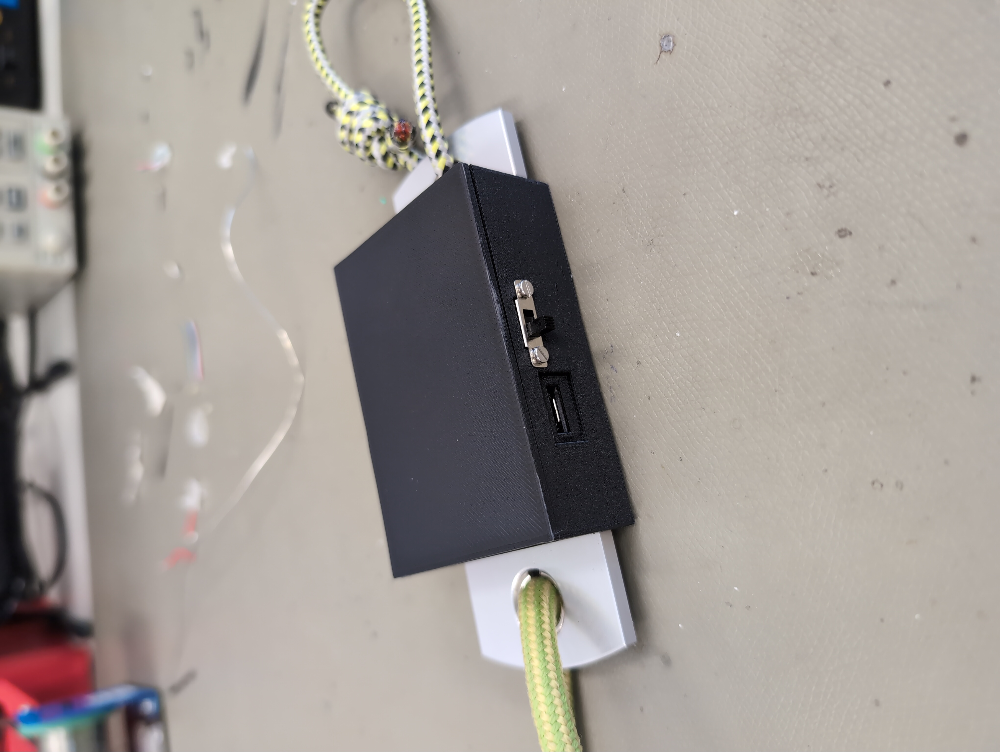

# DIY Tindeq
When training for climbing, you will come across some specialzied training tools. 

Some measure the force the climber can pull on a ledge, and visualize them on a phone. 
Those devices are quite expensive, so this is my try to build my own. 

This project is based on a crane-scale to get the strain gauge. 
To measure the small Voltage across it, the HX711 IC is used. To visualize and process
the data, I use a ESP32 S3. I went for S3 because it can be programmed directly via usb, without the need for additional usb-serial adapters. 

In the current Version (V1) There are 4 pads on the left, that are connected to the strain gauge. 
On the right side, there are 4 pads for power supply. V-bus and b-gnd are 5V and gnd from the usb port. They will be connected to external Battery management system. The output of the external Battery mangement System will be connected to OUT+ and OUT- 

The pcb is designed to support charging via USB and programming via usb. 
I am using a TP4056 Module for Managing the single cell Lithium batterie. Make sure your BMS support overdischarge protection and overcharging protection. 

The pcb is not tested yet, I will probably continue updating this repo after testing. 

## Update 16.03.26

I assembled the PCB and did some testing. Soldering the mcp1727 is quite tricky. I ended up putting some soldern on the pads with a soldering iron, then adding flux and heating up the whole area with a hot air gun. 
Ideally I would recommend using a different package LDO. (maybe the 1727 even exists in a better package?)

The other components are fine with some experience in SMD soldering.

Flashing the software to the ESP32 S3 was not trivial. I used the wrong configuration (wrong flash size selected). After that the ESP ended up in a boot cycle. I had to manually bridge the boot en EN pin to bring it back into bootload mode. 

## Update 26.03.26

After some more testing it was obvious that the sensor readings were very noisy. However the issue was quite easy to fix. In the inital build of the prototype I fixed the wires from the sensor to the pcb with hot glue. That formed a loop together with the alloy. The Wifi Antenna of the ESP induced voltages into that loop, which ruined the sensor readings. After removing the hot glue and running the wires further away from the antenna, the measurements were fine. 

## Update 14.04.26
In the last month I used the prototype a bit, and I was quite happy with the way it worked. So I decided to design my first 3D case and try to print it. I was surprised how easy it was to learn, and I can definitely recommend! That is one evening well invested in my opinion. To get started I can recommend Tinkercad. It is a browser based 3D modeling software with very limited features but totally powerful enough for what I am doing. The next day I was able to print it in my local makerspace and place all the components in the case.

In this photo you can see an issue that I encountered. While testing to prototype, I hot glued the wires from the strain gauge to the pcb. This turned out to be a problem because the hot glue was a little bit too hot and held on to the pcb too well. When I tried to remove it, one of the soldering pads ripped off the pcb. I found a different place to solder the wire to (Capacitor 9) but that Capacitor is a bit far away from the soldering pad for gnd. That opens up a "loop" between ground and VCC, which results in a very noisy signal.

However the solution was equally easy and elegant. As you can see the red and the black wire form a loop, cross and then go to their soldering pads. So in total there are two loops. Those have approximately the same size, but a different orientation. Therefore the induced voltages cancel out quite nicely. 

After I tested the functions of the board one last time, I glued the lid to the case.

## Lessons Learned

 - use bigger package for MCP1727 or order a stencil to reflow solder the pcb
 - install some Status leds for the ESP
 - install some power LED for the board
 - include the BMS on the pcb for the next rev of the board
 - The micro USB plug has the wrong footprint. need to fix that!
 - maybe put some thought into the form factor next time
 - the esp32 pins closest to the antenna are quite hard to solder, if the solder tip is too small

